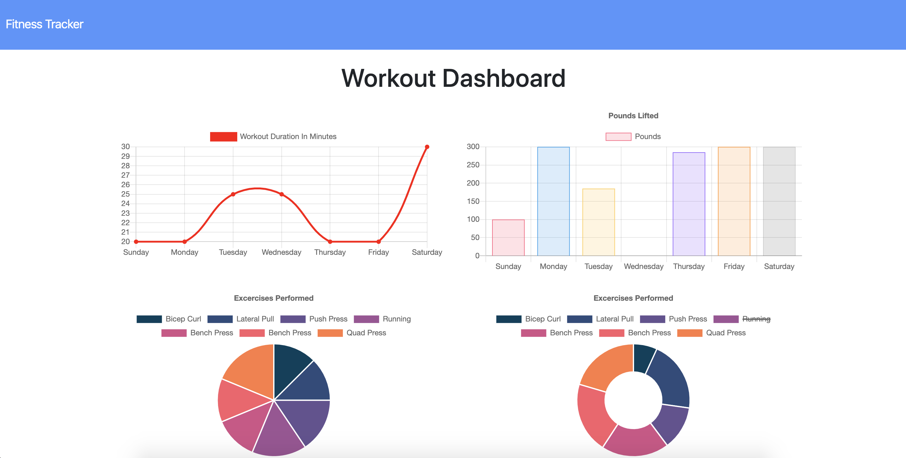

# NoSQL Workout Tracker!
App using express and mongoose to track workouts via input of the workouts and tracking duration with active charts.

## Example

## Heroku
* [Click here for Heroku deployment](https://nameless-cliffs-01253.herokuapp.com/)

### User Story
* As a person that wants to exercise
* I want to view my workouts and track them
* So that I can manage or view my activity and progress